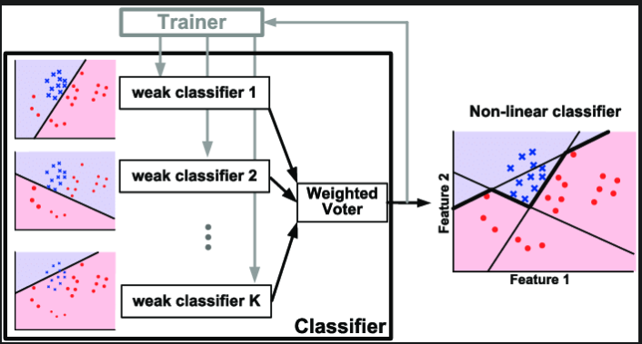
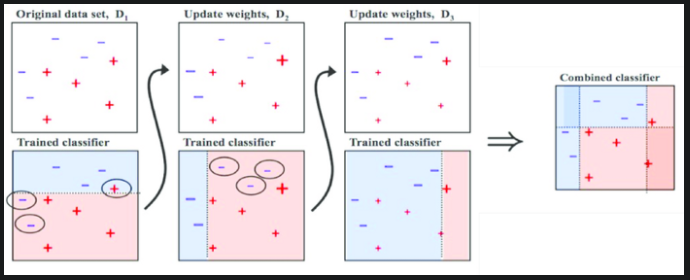
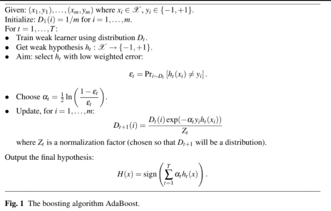

# Adaboost
[sample code](./adaboost.py)

AdaBoost is a popular boosting technique which helps you combine multiple “weak classifiers” into a single “strong classifier”.  
A weak classifier is simply a classifier that performs poorly, but performs better than random guessing.  

### example
classifying a person as male or female based on their height.
You could say anyone over 5’ 9” is a male and anyone under that is a female.  
You’ll misclassify a lot of people that way, but your accuracy will still be greater than 50%.

AdaBoost can be applied to any classification algorithm, so it’s really a technique that builds on top of other classifiers as opposed to being a classifier itself.

<p align="center">
  
  
  
</p>

## Get Started
```cmd
cd ./ML_Algorithms/adaboost
python3 adaboost.py
```

# Resource
- https://xavierbourretsicotte.github.io/AdaBoost.html
- https://towardsdatascience.com/understanding-adaboost-for-decision-tree-ff8f07d2851
- https://www.youtube.com/watch?v=LsK-xG1cLYA
- https://maelfabien.github.io/machinelearning/adaboost/#weighted-errors
- https://towardsdatascience.com/boosting-and-adaboost-clearly-explained-856e21152d3e
- https://geoffruddock.com/adaboost-from-scratch-in-python/
- https://www.cs.toronto.edu/~mbrubake/teaching/C11/Handouts/AdaBoost.pdf