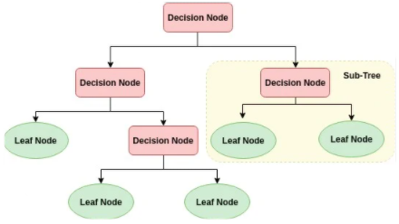
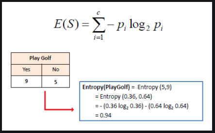

# Decision Tree
[sample code](./decision_tree.py)

Decision Trees (DTs) are a non-parametric supervised learning method used for classification and regression.  
Decision trees learn from data to approximate a sine curve with a set of if-then-else decision rules.  
The final result is a tree with decision nodes and leaf nodes. A decision node has two or more branches

<p align="center">
  
  
  
</p>

## Get Started
```cmd
cd ./ML_Algorithms/decision_tree
python3 decision_treeost.py
```

# Resource
- https://towardsdatascience.com/entropy-how-decision-trees-make-decisions-2946b9c18c8
- https://machinelearningmastery.com/implement-decision-tree-algorithm-scratch-python/
- https://www.kdnuggets.com/2019/08/understanding-decision-trees-classification-python.html
- https://www.saedsayad.com/decision_tree.htm