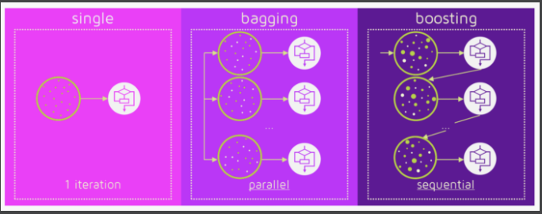
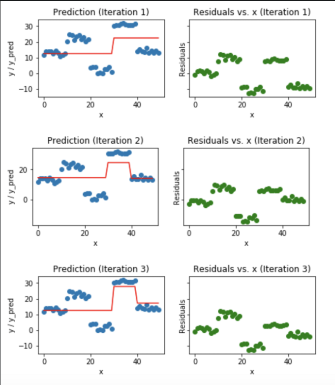
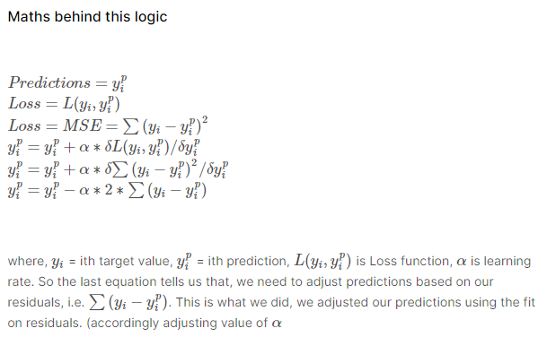

# Gradient Boosting
[sample code](./gradient_boosting.py)

The Gradient Boosting (GB) algorithm trains a series of weak learners and each focuses on the errors the previous learners have made and tries to improve it.  
Together, they make a better prediction.

According to Wikipedia, Gradient boosting is a machine learning technique for regression and classification problems, which produces a prediction model in the form of an ensemble of weak prediction models, typically decision trees.  
It builds the model in a stage-wise fashion as other boosting methods do, and it generalizes them by allowing optimization of an arbitrary differentiable loss function.

To understand `Gradient Boosting` , it would be nice to learn first:
- [Decision Trees](../decision_tree)
- [Adaboost](../adaboost)
- [Gradient Descent](../gradient_descent)
<p align="center">
  
  
  
</p>

## Get Started
```cmd
cd ./ML_Algorithms/gradient_boosting
python3 gradient_boosting.py
```

# Resource
- https://www.kaggle.com/grroverpr/gradient-boosting-simplified/
- https://explained.ai/gradient-boosting/index.html
- https://explained.ai/gradient-boosting/L2-loss.html
- https://explained.ai/gradient-boosting/L1-loss.html
- https://explained.ai/gradient-boosting/descent.html
- https://relguzman.blogspot.com/2018/04/gradient-boosting-decision-tree-gbdt.html
- https://ericwebsmith.github.io/2020/04/19/GradientBoostingClassification/
- https://www.youtube.com/watch?v=UHBmv7qCey4
- https://www.youtube.com/watch?v=sRktKszFmSk
- https://www.youtube.com/watch?v=3CC4N4z3GJc