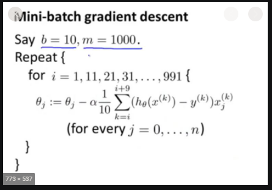

# Gradient Decent

In this repo i will explain in my own word how the following `Optimization Algorithms` are working:
- `Gradient Decent`
- `Batch Gradient Descent`
- `Mini-batch Gradient Descent`
- `Tochastic Gradient Descent`

Optimization Algorithms will make the accuracy and the precision of the output.  
so this image there are 3 lines drawn and they all can be a possible output of the calculation of getting the average location of all given blue points.  

For getting the most precised output we need to try a location and look if all blue points are closer to the line, And after some While you get the perfect outcome.  
This is for example what `Gradient Decent` Does.
<p align="center">
  
</p>

## Get Started
```cmd
cd ./ML_Algorithms/gradient_descent

python3 example.py
python3 batch_gradient_descent.py
python3 mini_batch_gradient_descent.py
python3 stochastic_gradient_descent.py
```

### __Learning rate__
So we need to get new [slope](https://www.dummies.com/education/math/statistics/how-to-interpret-a-regression-line/#:~:text=In%20a%20regression%20context%2C%20the,Y%20per%20change%20in%20X.) position.  
Therefore, `learning Rate` decide the size of a step to the next training set.  
If `learning rate` is very small, it would take long time to converge and become computationally expensive.  
If `learning rate` is large, it may fail to converge and overshoot the minimum. 
<p align="center">
  
</p>

(The most commonly used rates are : `0.001`, `0.003`, `0.01`, `0.03`, `0.1`, `0.3`)  

### __Scaling__
The data can have a lot of different values, this has a few drawbacks.   
- Hard to read the data.
- Can result in a slow or unstable process.

Therefore we have the following ways of scalling:
- `Normalization`  : lowest value = `0` & higest value = `1`  
- `Standardization`: center of all values = `0,0` (use when values contains < 0) 

We will use `Normalization` in our followed samples. (as our values are not below `0`) 
<p align="center">
  
</p>   

([broader explanation](https://machinelearningmastery.com/how-to-improve-neural-network-stability-and-modeling-performance-with-data-scaling/) for scaling)  

### __illustration Of Gradient Descent__

[code sample](./example.py)  

If the [slope](https://www.dummies.com/education/math/statistics/how-to-interpret-a-regression-line/#:~:text=In%20a%20regression%20context%2C%20the,Y%20per%20change%20in%20X.) of the current value of w > 0, this means that we are to the right of optimal w*. Therefore, the update will be negative, and will start getting close to the optimal values of w*. However, if it’s negative, the update will be positive and will increase the current values of w to converge to the optimal values of w*.  
<p align="center">
  
  
</p>

# __Batch Gradient Descent__  
[code sample](./gradient_decent_batch.py)  

When we sum up over all `Gradient Decent` results, each iteration when performing the updates to the parameters. Therefore, for each update, we have to sum over all `Gradient Decent` results.  
```python
for i in range(num_epochs):
    gradient = calculate_gradient(data, params)
    params -= learning_rate * gradient
```  

Good:
- We can use fixed learning rate during training without worrying about learning rate decay.  
- It has straight trajectory towards the minimum and it is guaranteed to converge in theory to the global minimum if the loss function is convex and to a local minimum if the loss function is not convex.  
- It has unbiased estimate of gradients. The more the examples, the lower the standard error.  

Bad:
- Even though we can use vectorized implementation, it may still be slow to go over all examples especially when we have large datasets.  
- Each step of learning happens after going over all examples where some examples may be redundant and don’t contribute much to the update. 

<p align="center">
  
</p>

# __Mini-batch Gradient Descent__
[code sample](./mini_batch_gradient_descent.py)  

Instead of going over all `Gradient Decent` results (`Batch Gradient Descent`).  
This will sums up over lower number of `Gradient Decent` results, based on the batch 
size.  

We need to Shuffle the datasets to avoid pre-existing order of `Gradient Decent` results.  
If the training set size is not divisible by batch size, the remaining will be its own batch.  
```python
for i in range(num_epochs):
    np.random.shuffle(data)
    for batch in random_minibatches(data, batch_size=32):
        gradient = calculate_gradient(data, params)
        params -= learning_rate * gradient
```
(`batch_size` It is usually chosen as power of `2` such as `32`, `64`, `128`, `256`, `512`, etc.)  
GPU achieve to run faster on batch sizes such as power of `2`.

Good:
- It do `NOT` goes through all `Gradient Decent` results.  
- Randomly selecting examples will help avoid redundant/matched `Gradient Decent` results.  
- With `batch size < size` of training set, it adds noise to the learning process that helps improving generalization error.  

Bad:
- On each iteration, the learning step may go back and forth due to the noise, it wanders around the minimum region but never says `this is the lowest  point`.
- Due to the noise, the learning steps have more vibration and requires adding learning-decay to decrease the learning rate as we become closer to the minimum.

<p align="center">
  
  
</p>


# __Stochastic Gradient Descent__
[code sample](./stochastic_gradient_descent.py)  

The parameters update on each example (x^i,y^i).  
Therefore, learning happens on every example.  
Shuffle the training data set to avoid pre-existing order of examples.
```python
for i in range(num_epochs):
    np.random.shuffle(data)
    for example in data:
        gradient = calculate_gradient(example, params)
        params -= learning_rate * gradient
```
Goods and the Bads are like `2 times Mini-batch Gradient Descent`.  

<p align="center">
  
</p>


# Resources
- https://developer.ibm.com/technologies/artificial-intelligence/articles/linear-regression-from-scratch/
- https://towardsdatascience.com/gradient-descent-in-python-a0d07285742f
- https://towardsdatascience.com/gradient-descent-algorithm-and-its-variants-10f652806a3
- https://d2l.ai/chapter_optimization/#
- https://stats.stackexchange.com/questions/189652/is-it-a-good-practice-to-always-scale-normalize-data-for-machine-learning
- https://machinelearningmastery.com/how-to-improve-neural-network-stability-and-modeling-performance-with-data-scaling/
- https://www.dummies.com/education/math/statistics/how-to-interpret-a-regression-line/#:~:text=In%20a%20regression%20context%2C%20the,Y%20per%20change%20in%20X.
- https://builtin.com/data-science/gradient-descent
- https://towardsdatascience.com/implement-gradient-descent-in-python-9b93ed7108d1
- https://stats.stackexchange.com/questions/153531/what-is-batch-size-in-neural-network
- https://medium.com/@lachlanmiller_52885/understanding-and-calculating-the-cost-function-for-linear-regression-39b8a3519fcb
- https://medium.com/@lachlanmiller_52885/machine-learning-week-1-cost-function-gradient-descent-and-univariate-linear-regression-8f5fe69815fd
- https://philippmuens.com/gradient-descent-from-scratch