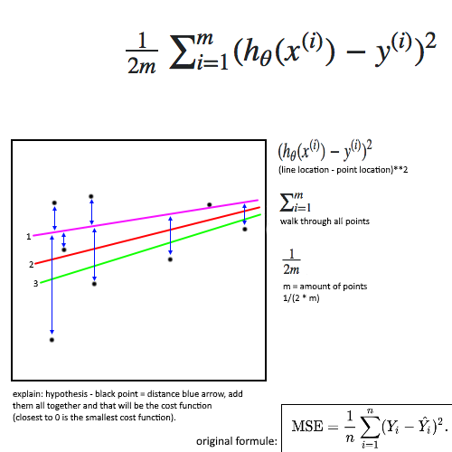

# Cost Functions
(`cost function == to compute error`)

The actual calculation is just the `hypothesis` value for `h(x)`, `minus` the actual value of `y`.  
Then you `square` whatever you get.  
The final result will be a single number. We repeat this process for all the `hypothesis`, in this case 1, 2 and 3.  
Whichever has the lowest result, or the lowest `“cost”` is the best fit of the three hypothesis.

ThereFore the `cost function` exists to calculate the distance off all point from the `hypothesis` (line 1/2/3).  

  

  

# Resources
- https://medium.com/@lachlanmiller_52885/understanding-and-calculating-the-cost-function-for-linear-regression-39b8a3519fcb
- https://stackoverflow.com/questions/21099289/cant-understand-the-cost-function-for-linear-regression  
- https://stackoverflow.com/questions/13623113/can-someone-explain-to-me-the-difference-between-a-cost-function-and-the-gradien