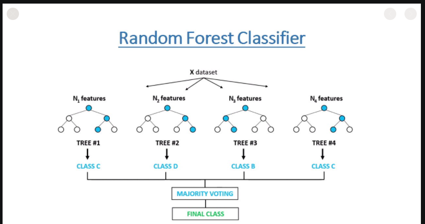
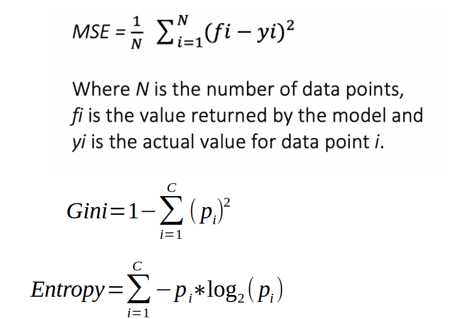

# Random Forest Algorithm
[code sample](./random_forest_algorithm.py)

Random forest is a `supervised learning algorithm`.  
The "forest" it builds, is an ensemble of decision trees, usually trained with the “bagging” method.  
The general idea of the bagging method is that a combination of learning models increases the overall result.

### Sample
Andrew wants to decide where to go during one-year vacation, so he asks the people who know him best for suggestions.  
The first friend he seeks out asks him about the likes and dislikes of his past travels.  
Based on the answers, he will give Andrew some advice.

This is a typical decision tree algorithm approach.  
Andrew's friend created rules to guide his decision about what he should recommend, by using Andrew's answers. 

Afterwards, Andrew starts asking more and more of his friends to advise him and they again ask him different questions they can use to derive some recommendations from.  
Finally, Andrew chooses the places that where recommend the most to him, which is the typical random forest algorithm approach.  

To understand `Random Forest` , it would be nice to learn first:
- [Gradient Boosting](../gradient_boosting)
<p align="center">
  
  
</p>

## Get Started
```cmd
cd ./ML_Algorithms/random_forest
python3 random_forest.py
```

# Resources
- https://builtin.com/data-science/random-forest-algorithm
- https://towardsdatascience.com/an-implementation-and-explanation-of-the-random-forest-in-python-77bf308a9b76
- https://machinelearningmastery.com/implement-random-forest-scratch-python/
- https://medium.com/capital-one-tech/random-forest-algorithm-for-machine-learning-c4b2c8cc9feb
